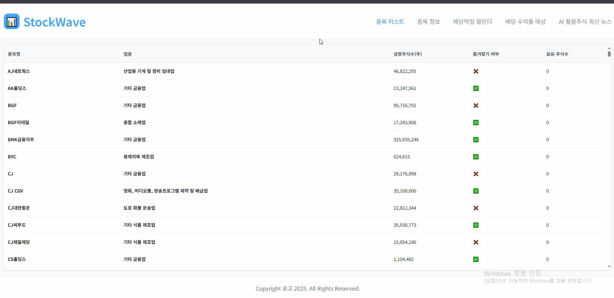
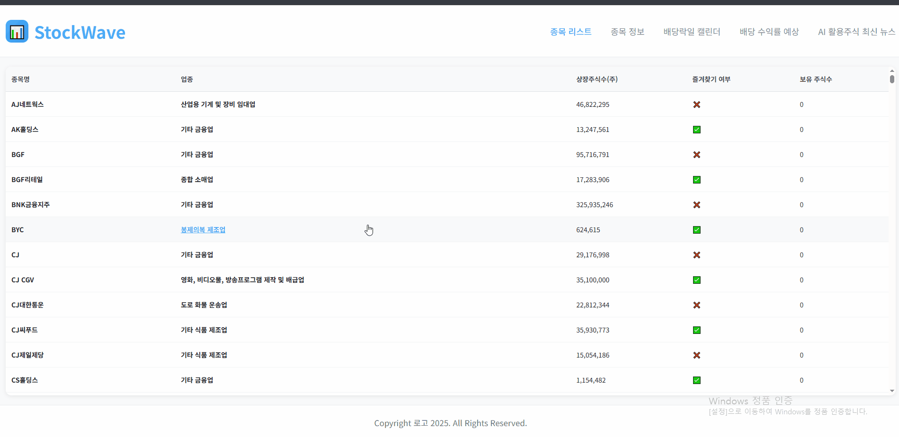
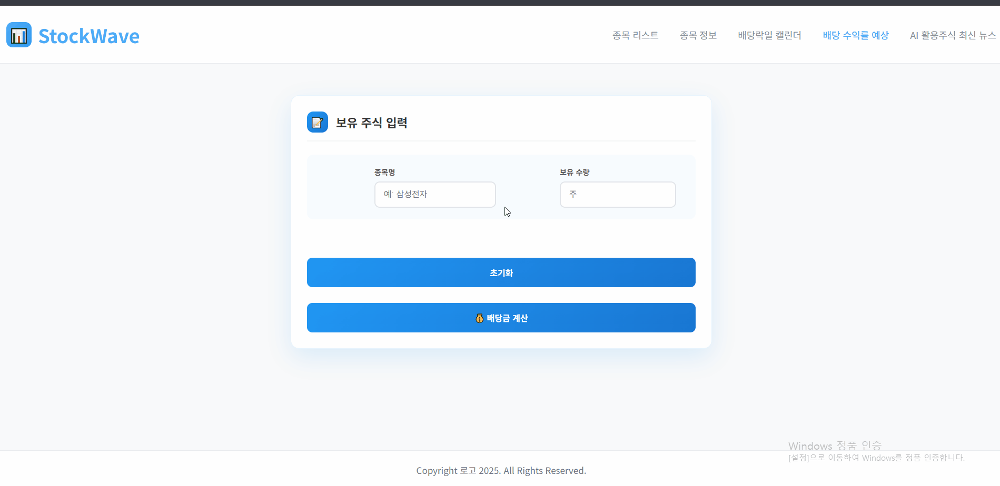
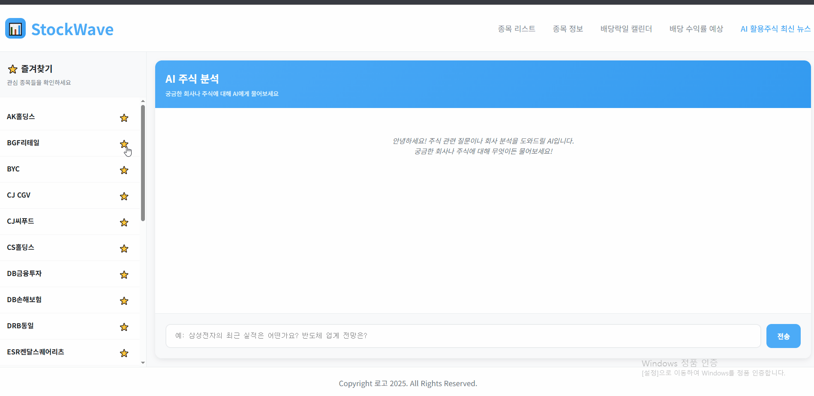

# 📊 StockWave - 주식 정보 통합 플랫폼

> **AI를 활용한 종합 주식 정보 서비스**  
> 실시간 주식 데이터 조회부터 배당금 예측, AI 뉴스 분석까지 한 번에!


## 🌟 프로젝트 소개

**StockWave**는 개인 투자자를 위한 종합 주식 정보 플랫폼입니다. 공공 데이터 API와 AI 기술을 활용하여 실시간 주식 정보 조회, 배당금 수익률 예측, AI 기반 뉴스 분석 등 다양한 투자 도구를 제공합니다.

## [📷 데모 영상 Youtube로 이동하기](https://youtu.be/fzge2SQX_3U)


### ✨ 주요 기능

- **📈 실시간 주식 정보 조회**: 시가, 종가, 고가, 저가, 시가총액 등 상세 정보 제공
- **📅 배당락일 캘린더**: 시각적 캘린더로 배당락일을 한눈에 확인
- **💰 배당금 수익률 예측**: 보유 주식 수량 기반 예상 배당 수익 계산
- **🤖 AI 뉴스 분석**: OpenAI GPT를 활용한 주식 관련 뉴스 및 분석 정보 제공
- **⭐ 즐겨찾기 기능**: 관심 종목을 저장하여 빠른 접근 가능
- **🔍 실시간 검색**: 자동완성 기능을 통한 편리한 종목 검색

## 📊 주요 화면

### 1. 종목 리스트
- 전체 상장 기업 목록 조회
- 실시간 검색 및 필터링
- 즐겨찾기 추가/제거



### 2. 종목 상세 정보
- 실시간 주가 정보
- 시가총액, 거래량 등 상세 데이터
- 차트 및 변동률 표시


### 3. 배당락일 캘린더
- 월별 배당락일 시각화
- 종목별 배당 일정 확인
- 년도별 필터링 기능


### 4. 배당금 계산기
- 보유 주식 수량 입력
- 과거 배당 이력 기반 예측
- 예상 수익률 계산


### 5. AI 뉴스 분석
- 종목별 맞춤 분석
- 실시간 채팅 인터페이스
- 투자 인사이트 제공


## 🛠 기술 스택

### Backend
- **Java 17+**: 메인 백엔드 언어
- **Apache Tomcat**: 웹 애플리케이션 서버
- **Servlet/JSP**: 웹 요청 처리 및 동적 페이지 생성
- **Maven**: 의존성 관리 및 빌드 도구

### Frontend
- **HTML5/CSS3**: 마크업 및 스타일링
- **Vanilla JavaScript**: 동적 UI 및 API 통신
- **Responsive Design**: 모바일 친화적 반응형 웹

### Architecture Pattern
- **MVC Pattern**: Model-View-Controller 아키텍처
- **Command Pattern**: 요청별 독립적인 처리 로직
- **DAO Pattern**: 데이터 액세스 계층 분리

### API & Libraries
- **한국투자정보 주식 API**: 실시간 주식 데이터
- **OpenAI GPT API**: AI 기반 뉴스 분석
- **OkHttp3**: HTTP 클라이언트
- **Gson**: JSON 파싱
- **Jackson**: JSON 처리
- **jQuery**: DOM 조작 및 이벤트 처리

## 🏗 프로젝트 구조

```
StockProject/
├── src/main/java/
│   ├── command/                    # Command Pattern 구현
│   │   ├── StockInfoCommand.java
│   │   ├── AiCommentCommand.java
│   │   └── ...
│   ├── controller/                 # MVC Controller
│   │   └── StockWaveController.java
│   ├── model/
│   │   ├── service/               # 비즈니스 로직
│   │   ├── dao/                   # 데이터 액세스 계층
│   │   ├── vo/                    # Value Object
│   │   └── apiUtil/               # API 유틸리티
│   └── servlet/                   # Legacy Servlet 클래스
├── src/main/webapp/
│   ├── html/                      # JSP 뷰 파일
│   ├── css/                       # 스타일시트
│   ├── js/                        # JavaScript 파일
│   └── WEB-INF/
└── pom.xml                        # Maven 설정
```

## 🚀 시작하기

### 필수 요구사항
- **Java**: 17 이상
- **Apache Tomcat**: 9.0 이상
- **Maven**: 3.6 이상
- **API Keys**: 한국투자정보 API, OpenAI API

### 설치 및 실행

1. **저장소 클론**
   ```bash
   git clone https://github.com/your-username/StockWave.git
   cd StockWave
   ```

2. **API 키 설정**
   ```bash
   # src/main/resources/api.properties 파일 생성
   STOCK_KEY=your_korean_investment_api_key
   OPENAI_KEY=your_openai_api_key
   ```

3. **의존성 설치**
   ```bash
   mvn clean install
   ```

4. **Tomcat 서버 배포**
   - WAR 파일을 Tomcat webapps 디렉토리에 배포
   - 또는 IDE에서 Tomcat 서버 설정 후 실행

5. **애플리케이션 접속**
   ```
   http://localhost:8888/html/stockList.jsp
   ```
   

## 🔧 주요 기술 구현

### Command Pattern을 통한 요청 처리
```java
// URL 패턴에 따른 동적 Command 객체 생성
String className = "command." + command.substring(0, 1).toUpperCase() 
                  + command.substring(1) + "Command";
Class commandClass = Class.forName(className);
StockWaveMainCommand commandObj = (StockWaveMainCommand) commandClass.newInstance();
commandObj.process(req, resp);
```

### 비동기 API 통신
```javascript
// 실시간 주식 데이터 조회
async function fetchStockData() {
    const response = await fetch('http://localhost:8888/stockList.stockwave');
    const data = await response.json();
    renderTable(data);
}
```

### AI 챗봇 구현
```java
// OpenAI API를 활용한 주식 분석
ObjectNode user = mapper.createObjectNode();
user.put("role", "user");
user.put("content", question);
// GPT 모델을 통한 응답 생성
```

## 🎯 프로젝트 특징

### 1. **확장 가능한 아키텍처**
- Command Pattern으로 새로운 기능 추가 용이
- Service-DAO 계층 분리로 유지보수성 향상

### 2. **사용자 중심 UI/UX**
- 반응형 디자인으로 모든 기기에서 최적화
- 직관적인 인터페이스와 실시간 피드백

### 3. **실시간 데이터 처리**
- 공공 API를 활용한 정확한 주식 정보
- 비동기 처리로 빠른 응답성 구현

### 4. **AI 기반 인사이트**
- GPT를 활용한 개인화된 투자 분석
- 자연어 처리 기반 사용자 질의응답

## 📈 향후 추가 기능 계획 !

- [ ] **실시간 알림 기능**: 목표가 도달 시 알림
- [ ] **포트폴리오 관리**: 투자 현황 추적 및 분석
- [ ] **차트 기능**: 기술적 분석 도구 제공
- [ ] **모바일 앱**: React Native 기반 모바일 버전
- [ ] **소셜 기능**: 투자 아이디어 공유 플랫폼

---

⭐
